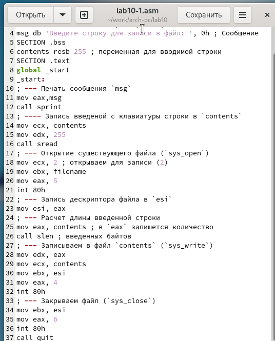
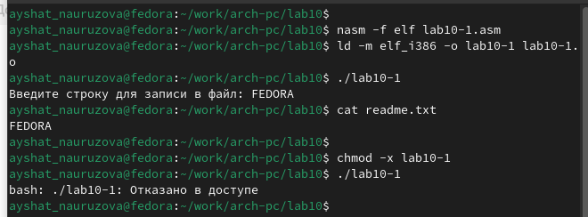
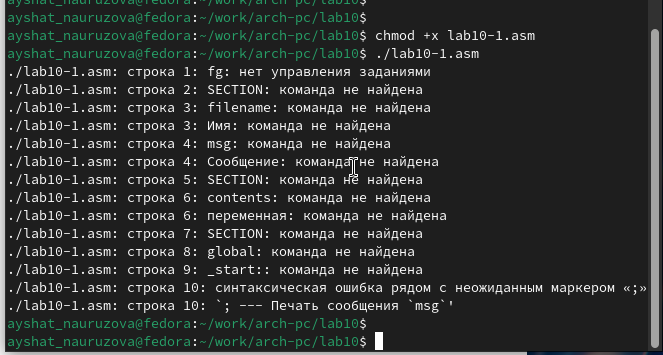
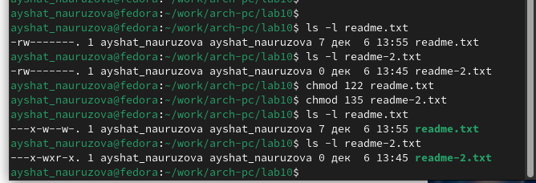

---
## Front matter
title: "Отчёт по лабораторной работе 10"
subtitle: "Архитектура компьютеров"
author: "Наурузова А.М. НПИбд-03-24"

## Generic otions
lang: ru-RU
toc-title: "Содержание"

## Bibliography
bibliography: bib/cite.bib
csl: pandoc/csl/gost-r-7-0-5-2008-numeric.csl

## Pdf output format
toc: true # Table of contents
toc-depth: 2
lof: true # List of figures
lot: true # List of tables
fontsize: 12pt
linestretch: 1.5
papersize: a4
documentclass: scrreprt
## I18n polyglossia
polyglossia-lang:
  name: russian
  options:
	- spelling=modern
	- babelshorthands=true
polyglossia-otherlangs:
  name: english
## I18n babel
babel-lang: russian
babel-otherlangs: english
## Fonts
mainfont: PT Serif
romanfont: PT Serif
sansfont: PT Sans
monofont: PT Mono
mainfontoptions: Ligatures=TeX
romanfontoptions: Ligatures=TeX
sansfontoptions: Ligatures=TeX,Scale=MatchLowercase
monofontoptions: Scale=MatchLowercase,Scale=0.9
## Biblatex
biblatex: true
biblio-style: "gost-numeric"
biblatexoptions:
  - parentracker=true
  - backend=biber
  - hyperref=auto
  - language=auto
  - autolang=other*
  - citestyle=gost-numeric
## Pandoc-crossref LaTeX customization
figureTitle: "Рис."
tableTitle: "Таблица"
listingTitle: "Листинг"
lofTitle: "Список иллюстраций"
lotTitle: "Список таблиц"
lolTitle: "Листинги"
## Misc options
indent: true
header-includes:
  - \usepackage{indentfirst}
  - \usepackage{float} # keep figures where there are in the text
  - \floatplacement{figure}{H} # keep figures where there are in the text
---

# Цель работы

Целью работы является приобретение навыков написания программ для работы с файлами.

# Выполнение лабораторной работы

Я создала каталог для лабораторной работы №10 и перешла в него. В этом каталоге создала три файла: lab10-1.asm, readme-1.txt и readme-2.txt.

В файле lab10-1.asm написала программу из листинга 10.1, которая записывает сообщение в файл. Затем скомпилировала код в исполняемый файл и проверила его работу (рис. [-@fig:001]).

{ #fig:001 width=70%, height=70% }

Программа запрашивает строку и записывает её в файл readme.txt. Если файла не существует, то строка не будет сохранена (рис. [-@fig:002]).

{ #fig:002 width=70%, height=70% }

Чтобы запретить выполнение исполняемого файла lab10-1, я использовала команду chmod для изменения прав доступа. Убрала атрибут "x" во всех трёх позициях. После этого попыталась выполнить файл.

Файл не запускается, так как выполнение запрещено из-за отсутствия атрибута "x" (рис. [-@fig:003]).

{ #fig:003 width=70%, height=70% }

Затем изменила права доступа к файлу lab10-1.asm, добавив разрешение на выполнение с помощью команды chmod. После этого попыталась снова выполнить файл (рис. [-@fig:004]).

Файл запустился, и терминал попытался выполнить его содержимое как команды командной строки. Однако, так как это код на языке ассемблера, а не команды терминала, возникли ошибки. Если же добавить в файл команды командной строки, их можно будет выполнить, запустив файл.

{ #fig:004 width=70%, height=70% }

Далее установила права доступа к файлам readme в соответствии с вариантом из таблицы 10.4. Для проверки правильности выполнения использовала команду ls -l (рис. [-@fig:005]).

Для варианта 9: --x -w- -w-  (001 011 101)

{ #fig:005 width=70%, height=70% }

---

## Задание для самостоятельной работы

Написала программу, работающую по следующему алгоритму (рис. [-@fig:006], [-@fig:007]):

1. Вывод приглашения: **“Как Вас зовут?”**.
2. Ввод с клавиатуры фамилии и имени.
3. Создание файла с именем name.txt.
4. Запись в файл строки: **“Меня зовут”**.
5. Дополнение файла строкой, введённой с клавиатуры.
6. Закрытие файла.

{ #fig:006 width=70%, height=70% }

{ #fig:007 width=70%, height=70% }

# Выводы

На практике освоила работу с файлами и управление правами доступа.
